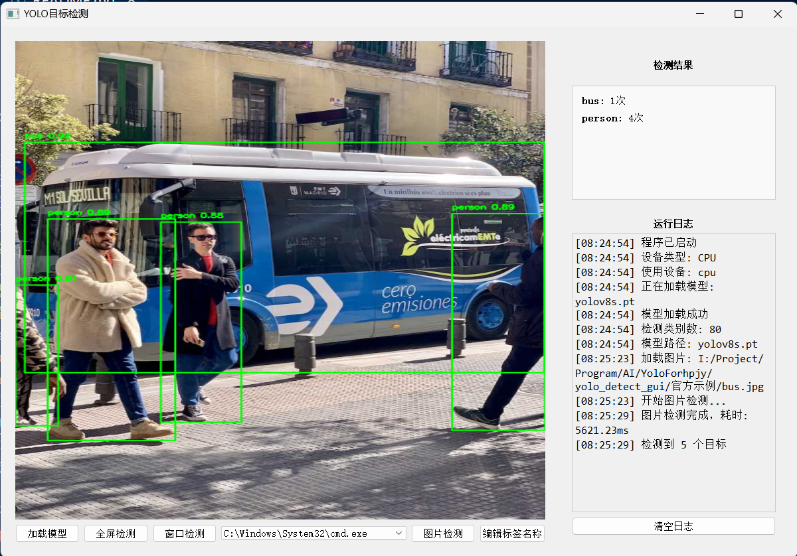

# 介绍
- 一款yolo检测gui界面
- 功能：
    1. 支持自动识别标签
    2. 选取图片检测
    3. 选取窗口实时检测
    4. 全屏检测

# 直接运行
- 直接运行run.bat即可
# 手动配置环境
### 配置环境
1. 安装anaconda，创建并激活conda环境
    - `conda create -n yolo python=3.10`
    - `conda activate yolo`
2. 安装正确的torch版本（根据你的cuda版本选择）
    - https://pytorch.org/get-started/locally/
    - 如`pip3 install torch torchvision torchaudio --index-url https://download.pytorch.org/whl/cu126`
    - 检验：运行`python test_env.py`
        - 如出现`CUDA is available!`，则环境配置正确；否则会使用cpu运行
3. 安装依赖
    `pip install -r requirements.txt`
4. 运行
    `python yolo_detect.py`

### cpu
打开anaconda prompt切换到源码目录
```
conda create -n yolo python=3.10
conda activate yolo
pip install -r requirements.txt
python yolo_detect.py
```