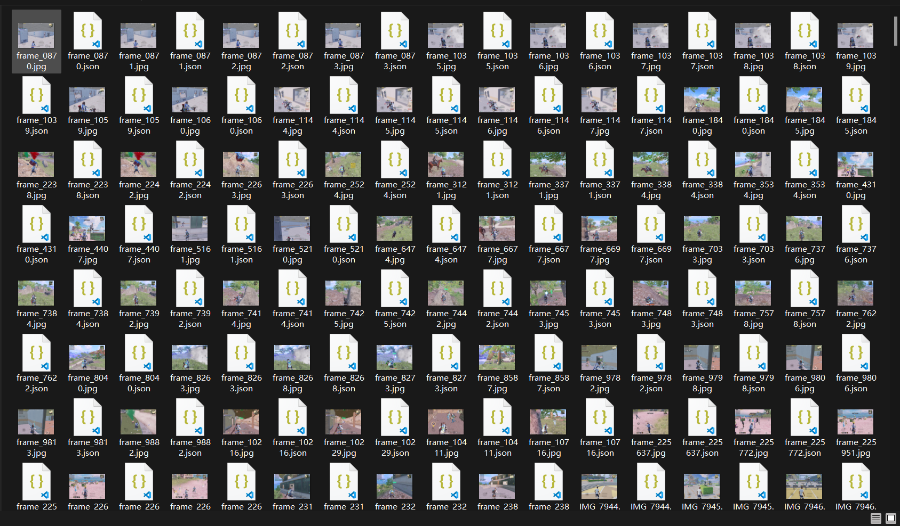

# 介绍
- 一款yolo检测gui界面
- 功能：
    1. 支持自动识别标签
    2. 选取图片检测
    3. 选取窗口实时检测
    4. 全屏检测

# 直接运行
- 在下面百度网盘下载带解释器的源码，直接运行run.bat即可（cpu也可，如需gpu建议自行配置环境）
链接：https://pan.baidu.com/s/19QgM2ohQIjSh9jXzLapnng?pwd=3091 
提取码：3091
# 手动配置环境
### 配置环境
1. 安装anaconda，创建并激活conda环境
    - `conda create -n yolo python=3.10`
    - `conda activate yolo`
2. 安装正确的torch版本（根据你的cuda版本选择）
    - https://pytorch.org/get-started/locally/
    - 如`pip3 install torch torchvision torchaudio --index-url https://download.pytorch.org/whl/cu126`
    - 检验：运行`python test_env.py`
        - 如出现`CUDA is available!`，则环境配置正确；否则会使用cpu运行
3. 安装依赖
    `pip install -r requirements.txt`
4. 运行
    `python yolo_detect.py`

### cpu
打开anaconda prompt切换到源码目录
```
conda create -n yolo python=3.10
conda activate yolo
pip install -r requirements.txt
python yolo_detect.py
```
# 模型
- 官方模型：当前目录下的yolov8s.pt
- hpjy专属模型：可在咸鱼或者淘宝上获取
【淘宝】99%买家好评 https://e.tb.cn/h.h0y8eRkHafystyC?tk=oZ1mVrt03Fp CZ007 「和平精英Yolo检测模型（带实时窗口检测框）」
点击链接直接打开 或者 淘宝搜索直接打开
【闲鱼】https://m.tb.cn/h.h0qXcu6?tk=FEMoVrtY5Dt HU591 「我在闲鱼发布了【出售和平精英YOLO模型及检测程序源码，包含队友、敌人、敌人】」
点击链接直接打开
