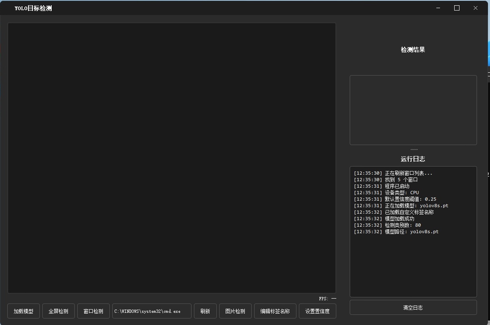

# YOLO目标检测GUI

一个基于YOLOv8和PyQt5的目标检测图形界面程序，支持实时检测、图片检测和自定义标签。

## 功能特点

- 支持CUDA加速（自动检测并使用可用的GPU），如不可使用则会自动切换为CPU模式
- 实时全屏检测
- 窗口选择检测
- 图片文件检测
- 自定义标签名称
- 可调节置信度阈值
- 实时FPS显示
- 深色主题UI
- 检测结果实时统计


## 要求

- Windows 10/11
- CUDA支持（可选，用于GPU加速）(https://developer.nvidia.com/cuda-toolkit-archive)
- 已安装anaconda(https://www.anaconda.com/download)
- 已安装pip(配置好镜像源)
   - 可参考https://blog.csdn.net/qq_42257666/article/details/117884849

## 安装步骤

1. 克隆或下载仓库：
```bash
git clone https://github.com/Wang-baizhu/yolo_detect_gui.git
```

2. 一键运行脚本
点击run.bat即可一键安装依赖并运行程序

### 安装对应CUDA版本的PyTorch说明（额外说明，自动脚本会自动运行）

首先检查CUDA版本：
```bash
nvcc --version
```

然后根据CUDA版本安装对应的PyTorch：
https://pytorch.org/get-started/previous-versions/

- CUDA 11.8:
```bash
pip3 install torch torchvision torchaudio --index-url https://download.pytorch.org/whl/cu118
```

- CUDA 11.7:
```bash
pip3 install torch torchvision torchaudio --index-url https://download.pytorch.org/whl/cu117
```

- CUDA 11.6:
```bash
pip3 install torch torchvision torchaudio --index-url https://download.pytorch.org/whl/cu116
```

- 仅CPU:
```bash
pip3 install torch torchvision torchaudio
```

## 功能说明

1. 自动检测安装对应版本pytorch

2. 加载模型：
   - 点击"加载模型"按钮
   - 选择YOLOv8/11模型文件（.pt格式）

3. 开始检测：
   - 全屏检测：点击"全屏检测"按钮
   - 窗口检测：从下拉列表选择窗口，点击"窗口检测"按钮
   - 图片检测：点击"图片检测"按钮，选择图片文件

4. 自定义标签：
   - 点击"编辑标签名称"按钮
   - 在弹出的对话框中修改显示名称
   - 点击确定保存更改

5. 调整置信度：
   - 点击"设置置信度"按钮
   - 输入0.0-1.0之间的值
   - 点击确定应用更改

## 注意事项

- 首次运行时会自动下载YOLOv8模型
- GPU加速需要正确安装CUDA和对应版本的PyTorch
- 自定义标签会自动保存到custom_labels.json文件中

## 许可证

MIT License